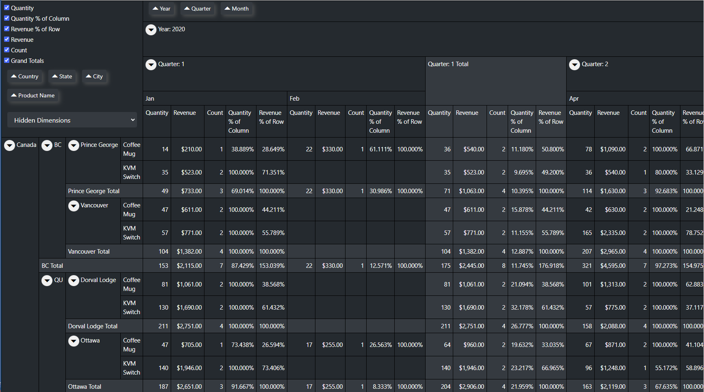

# LeaderPivot.Blazor

A pivot table control for Blazor.

* Drag and drop dimensions across axis
* User configurable measures

 

# Getting Started

[Get the demo application](https://github.com/leaderanalytics/LeaderPivot.BlazorDemo)

[Get the test data application](https://github.com/leaderanalytics/LeaderPivot.TestData)

[Get the Nuget package](https://www.nuget.org/packages/LeaderAnalytics.LeaderPivot.Blazor/)

Create a data structure to model your denormalized data.  See the [`SalesData`](https://github.com/leaderanalytics/LeaderPivot.TestData/blob/main/LeaderPivot.TestData/SalesData.cs) class for an example.

Create [Dimensions](https://github.com/leaderanalytics/LeaderPivot/blob/main/LeaderPivot/Dimension.cs) and [Measures](https://github.com/leaderanalytics/LeaderPivot/blob/main/LeaderPivot/Measure.cs).  Start by looking at how those objects are defined in the [TestData](https://github.com/leaderanalytics/LeaderPivot.TestData/blob/main/LeaderPivot.TestData/SalesData.cs) project.  Dimensions are used to group data.  Measures are used to create the values shown in each cell of the pivot table.

Add a [LeaderPivot control](https://github.com/leaderanalytics/LeaderPivot.BlazorDemo/blob/main/LeaderPivot.BlazorDemo/Pages/LeaderPivotDemo.razor) to your page.  

Add LeaderPivot to your [dependency injection container](https://github.com/leaderanalytics/LeaderPivot.BlazorDemo/blob/main/LeaderPivot.BlazorDemo/Program.cs):

`builder.Services.AddLeaderPivot();`